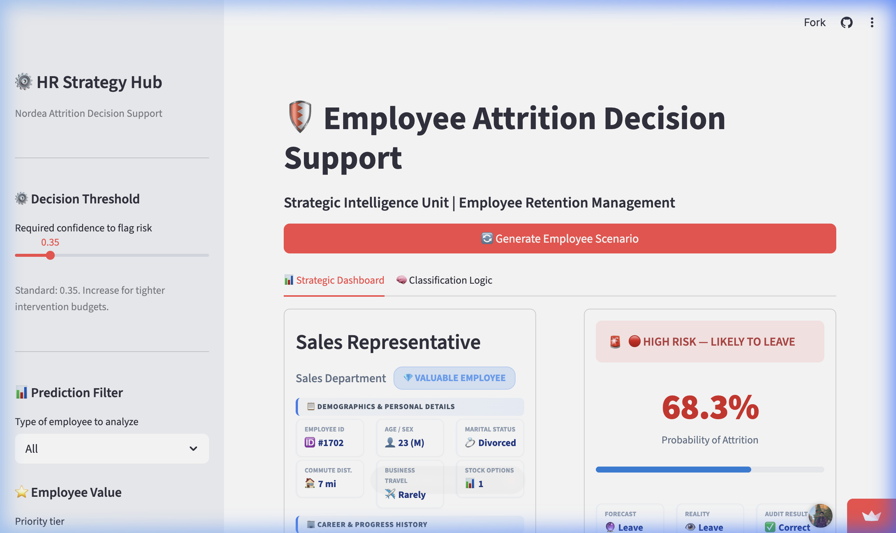
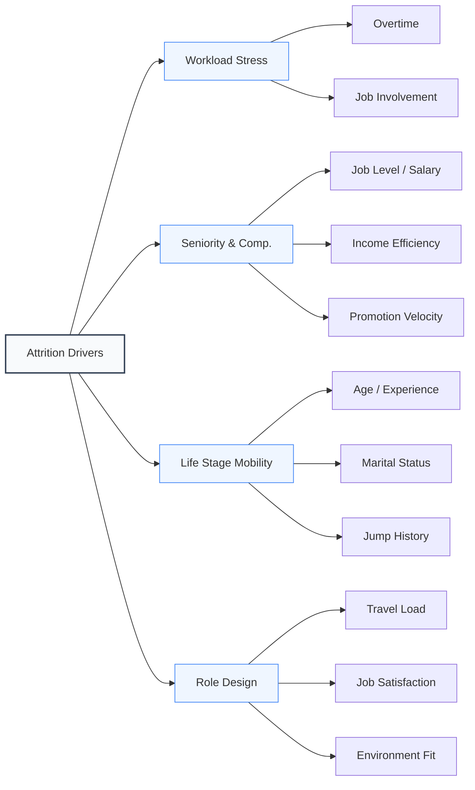
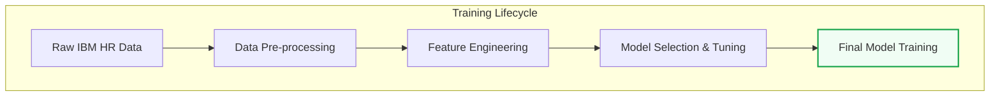
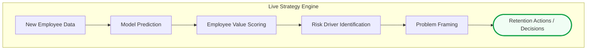
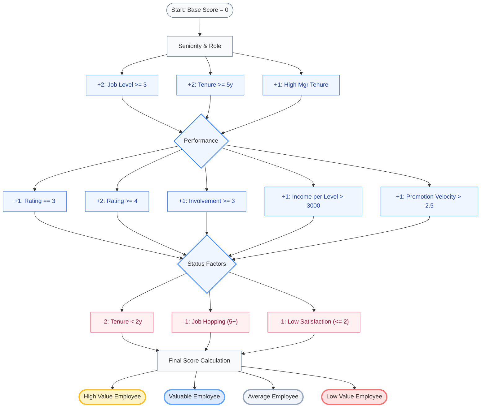
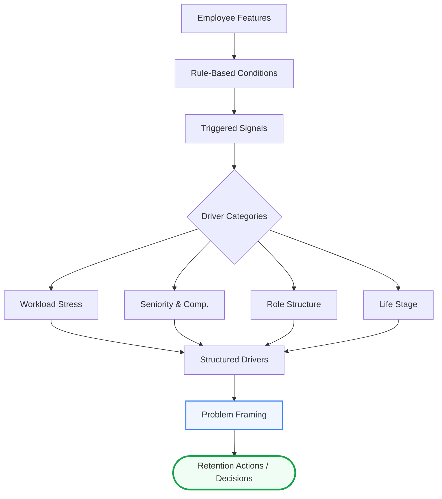
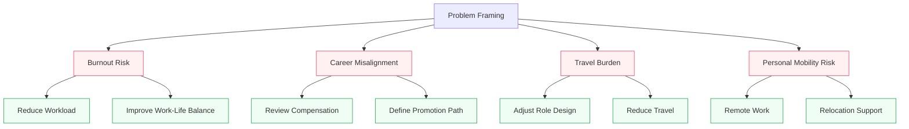

#  HR Attrition Intelligence Hub
### **Bridging Data Science with Structured Business Logic**
##  Problem & Value

Employee attrition is costly and difficult to manage proactively.

Most solutions stop at prediction — this system goes further by:
- Explaining *why* employees are at risk
- Prioritizing *who* to retain
- Recommending *what actions* to take

This project transforms attrition prediction into a **decision support system for HR strategy**.
---

##  Live Demo: Attrition Decision Support System
**Experience the live strategic dashboard here: [https://employee-retention-ai.streamlit.app/](https://employee-retention-ai.streamlit.app/)**



---


## ⚡ Quick Start

```bash
git clone https://github.com/Andrew-Hany/employee-attrition-decision-system.git
cd employee-attrition-decision-system
pip install -r requirements.txt
streamlit run app.py
```
---

---

## 📊 Phase 1: Exploratory Data Analysis (EDA)
Our initial discovery (detailed in [EDA.ipynb](EDA.ipynb)) revealed that attrition is driven by **four core strategic drivers**. By analyzing these sub-metrics, we can move from raw data to a strategic "Employee Value" classification.

### **The Attrition Driver Tree**


### **Strategic Pillar Details**
1.  **Workload:** Impact of overtime vs. role involvement.
2.  **Seniority & Compensation:** Evaluation of salary competitiveness (Income Efficiency) and growth rate (Promotion Velocity).
3.  **Life Stage:** Factors in external tenure stability and professional mobility.
4.  **Role Structure:** Focuses on travel burden and environmental satisfaction.

---


## ⚙️ Phase 2: Model Training Pipeline
The technical development of our predictive engine is detailed in [attrition_model.ipynb](attrition_model.ipynb). This stage focuses on transforming raw behavior features into a high-recall retention model.

### **The Training Workflow**


### **Model Selection & Performance Results**
We prioritized **Recall** (catching as many potential leavers as possible) while maintaining a balanced **Precision**. As shown below, **SMOTE (Oversampling)** was the key breakthrough in our modeling strategy.

| Experiment | Model | Threshold | Test ROC AUC | Recall (Leave) | Precision | F1-Score |
| :--- | :--- | :--- | :--- | :--- | :--- | :--- |
| **I. Baseline** | **Logistic Regression** | 0.35 | **0.810** | 0.489 | **0.535** | **0.511** |
| (No SMOTE) | CatBoost | 0.35 | 0.780 | 0.511 | 0.453 | 0.480 |
| | Random Forest | 0.40 | 0.779 | 0.170 | 0.444 | 0.246 |
| <hr> | <hr> | <hr> | <hr> | <hr> | <hr> | <hr> |
| **II. SMOTE** | ✨ **Logistic Regression** | **0.40** | **0.789** | 🚀 **0.766** | 0.353 | **0.483** |
| (Over-sampled) | Random Forest | 0.35 | 0.771 | 0.723 | 0.333 | 0.456 |
| | CatBoost | 0.35 | 0.758 | 0.681 | 0.327 | 0.441 |

> [!TIP]
> **Key Insight:** Moving from Baseline to SMOTE increased our ability to catch leavers (Recall) from **48.9%** to **76.6%**, which is critical for a proactive retention strategy.

### **Threshold Optimization**
The system uses a **Logistic Regression** model optimized at a **0.35 - 0.40 threshold**.
*   **Lower Threshold (0.35):** Maximizes Recall (Catching more potential leavers).
*   **Selection:** We chose **0.40** for the baseline to achieve a **76.6% Recall rate**.

---

## 🎯 Phase 3: Inference Strategy (Intelligence Hub)
The final system takes the trained model and wraps it in a **Human-Centric Intelligence Layer**. This hub transforms raw numerical predictions into a structured strategic narrative.

### **The Inference Pipeline**


---

### **1. Strategic Value Scoring Logic**
The system prioritizes retention for high-impact talent by processing model outputs through our **Value Scoring Engine**.



---

### **2. Risk Identification & Problem Framing**
This layer translates complex feature correlations into clear, human-readable **Business Problem Frames**.



---

### **3. Strategic Action Mapping**
Identified problems are linked directly to targeted HR interventions to ensure immediate, data-backed response.



---

## 🛠️ Technical Stack

- **Model:** Logistic Regression (optimized with SMOTE)
- **Explainability Layer:** Rule-based driver identification
- **Decision Engine:** Value scoring + problem framing
- **Interface:** Streamlit
- **Visualization:** Matplotlib, Seaborn, Mermaid

## 📂 Project Structure

- EDA.ipynb → Exploratory analysis
- attrition_model.ipynb → Model training & evaluation
- app.py → Streamlit application
- utils/ → Logic (scoring, drivers, recommendations)
- assets/ → Images & visuals
---

Developed by **Andrew Zaki**. 

