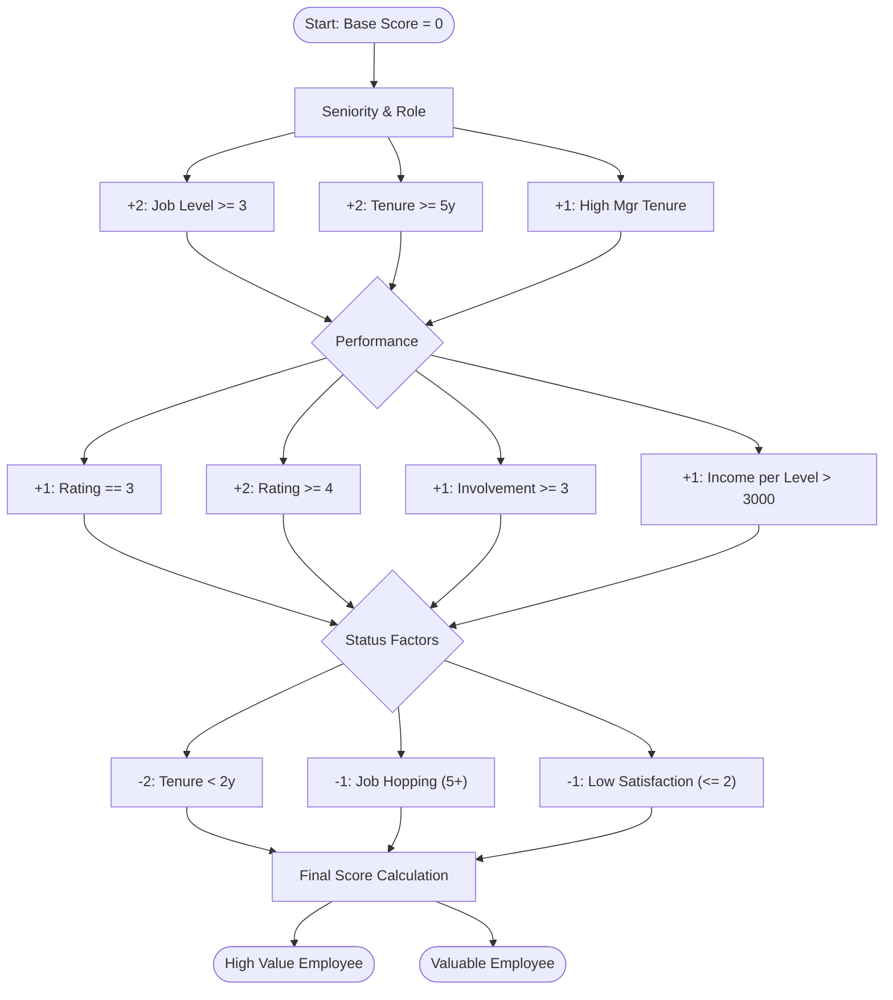
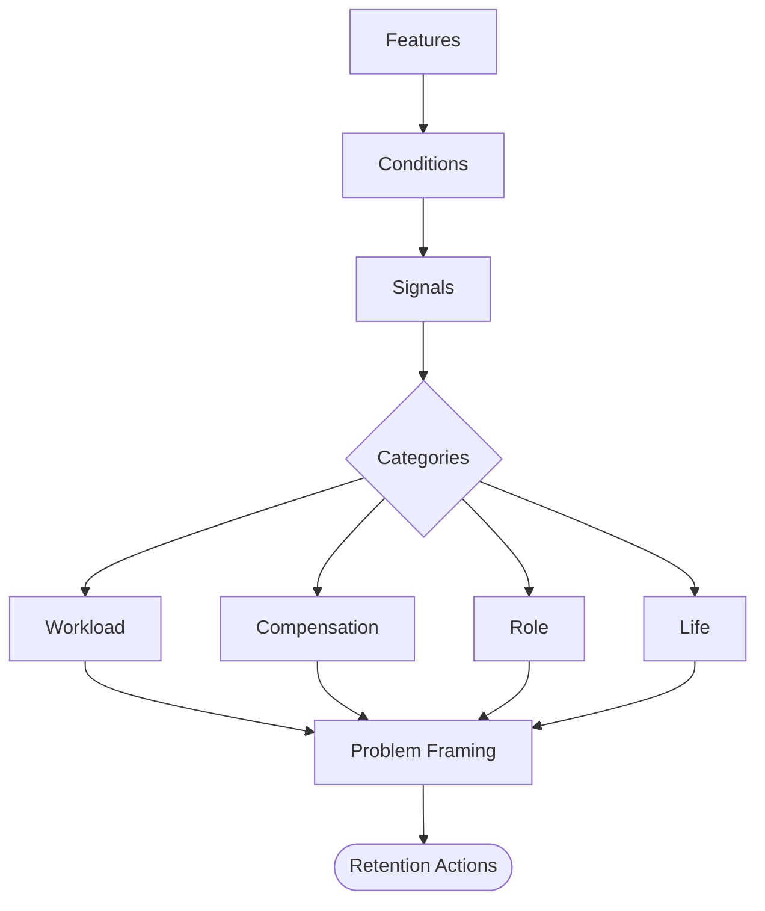
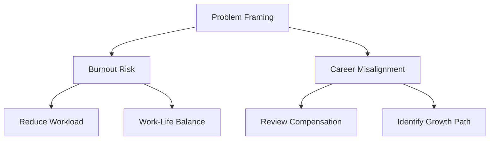

# 🧠 HR Attrition Intelligence Hub
### **End-to-End Decision Support: From Raw Data to Strategic Action**

---

## 📺 Live Strategic Dashboard
**Experience the final product here: [https://employee-retention-ai.streamlit.app/](https://employee-retention-ai.streamlit.app/)**

---

## 📊 Phase 1: Exploratory Data Analysis (EDA)
Based on our initial data discovery in the analysis notebooks, we identified that attrition is not random—it is driven by four key strategic pillars. 

### **The Four Strategic Pillars**
1.  **Workload:** Impact of overtime vs. role involvement.
2.  **Seniority & Compensation:** Evaluation of salary competitiveness per job level.
3.  **Life Stage:** External mobility factors and career stability.
4.  **Role Structure:** Environmental factors and travel requirements.

### **Strategic Value Scoring Tree**
We developed a points-based logic to prioritize retention efforts for high-impact talent.

---

## ⚙️ Phase 2: Model Training Pipeline
Detailed in `attrition_model.ipynb`, we tested multiple architectures to find the best balance between catching potential leavers (Recall) and maintaining accuracy (Precision).

### **Model Selection Results**
We found that **SMOTE (Oversampling)** was critical for performance due to the imbalanced nature of attrition data.

| Model | Threshold | Test ROC AUC | Recall (Leave) | Precision | F1-Score |
| :--- | :--- | :--- | :--- | :--- | :--- |
| **Without SMOTE** | | | | | |
| CatBoost | 0.35 | 0.780 | 0.311 | 0.453 | 0.480 |
| **Logistic Regression** | 0.35 | **0.810** | 0.489 | 0.535 | 0.511 |
| **With SMOTE** | | | | | |
| **Logistic Regression** | **0.40** | **0.789** | **0.766** | 0.353 | **0.483** |
| Random Forest | 0.35 | 0.771 | 0.723 | 0.333 | 0.456 |

### **Threshold Optimization**
The system uses a **Logistic Regression** model optimized at a **0.35 - 0.40 threshold**.
*   **Lower Threshold (0.35):** Maximizes Recall (Catching more potential leavers).
*   **Higher Threshold (0.50):** Maximizes Precision (Ensuring identified risks are highly likely to leave).
*   **Selection:** We chose **0.40** for the baseline to achieve a **76.6% Recall rate**.

---

## 🎯 Phase 3: Inference & Strategic Action
The final system takes the trained model and wraps it in a **Human-Centric Intelligence Layer**.

### **1. Risk Identification & Framing**
We translate raw features into structured business problems.

### **2. Strategic Action Mapping**
Problems are automatically mapped to specific HR interventions.

---

Developed by **Andrew Hany**. 
*Turning Workforce Data into Strategic Talent Retention.*
