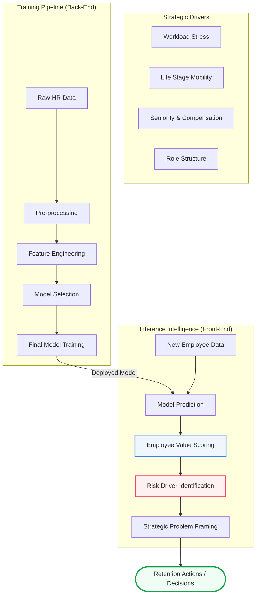
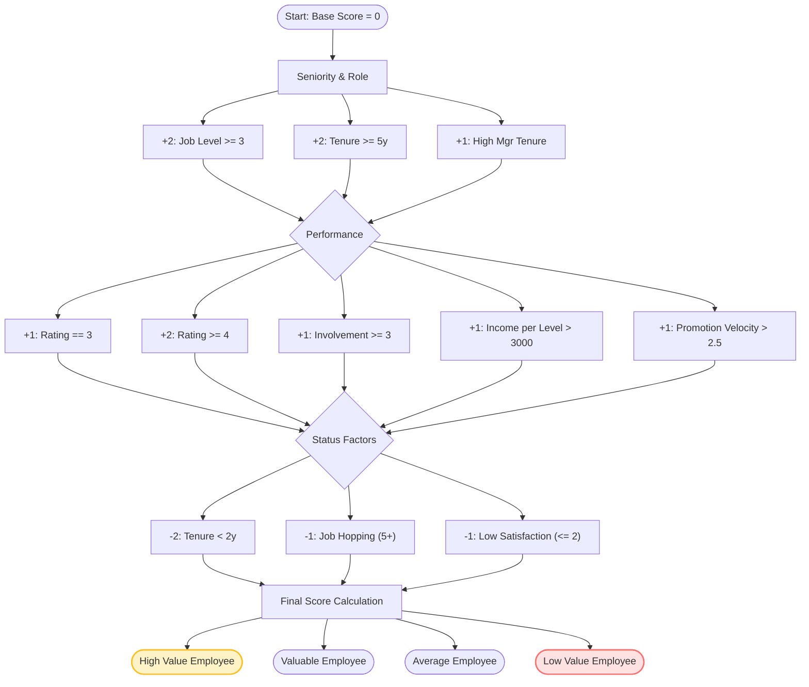
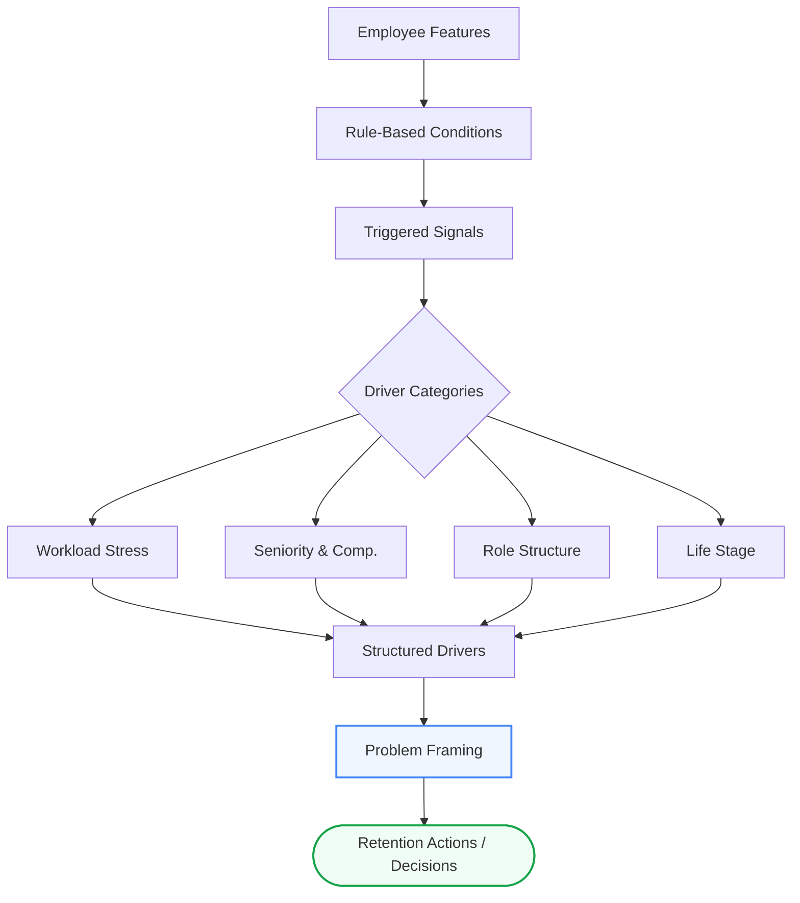
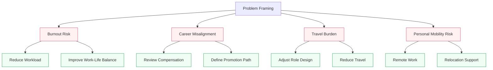

# 🧠 HR Attrition Intelligence Hub
### **Bridging Data Science with Structured Business Logic**

---

## 📺 Live Demo: Attrition Decision Support System
**Experience the live strategic dashboard here: [https://employee-retention-ai.streamlit.app/](https://employee-retention-ai.streamlit.app/)**

---

## 🗺️ System Architecture: The Big Picture
We combine data-driven prediction with structured business logic to turn raw workforce insights into high-impact retention actions.

---

## 💎 1. Employee Value Scoring Logic
Not all attrition is equal. Our system prioritizes retaining high-impact talent by scoring employees based on performance, growth velocity, and seniority.

**Logic Transparency in Action:**

---

## 🔍 2. Risk Identification & Problem Framing
We translate raw employee features into clear business problems using a multi-stage intelligence pipeline.

---

## 🎯 3. From Risk Drivers to Retention Actions
The system maps identified strategic problems to specific, actionable HR interventions to ensure consistency and speed in retention efforts.

---

## 🛠️ Technical Stack
*   **Predictive Model:** Random Forest / Gradient Boosting (Trained on IBM HR Attrition).
*   **Logic Engine:** Hierarchical thresholding and weighted value classification.
*   **Interface:** Streamlit (Custom Executive UI) with real-time Mermaid.js visualizations.

---

Developed by **Andrew Hany**. 
*Turning Workforce Data into Strategic Talent Retention.*
